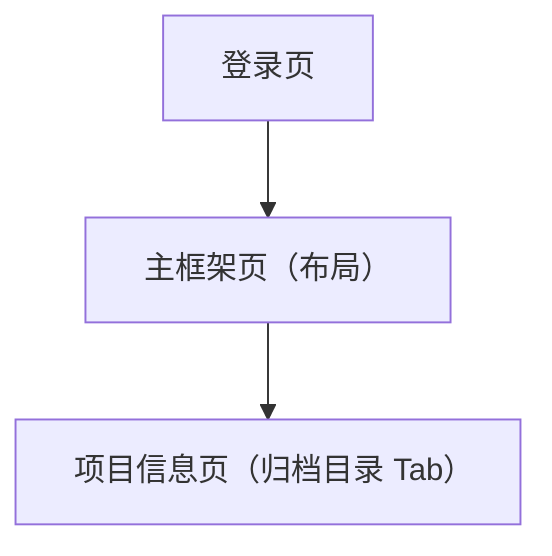

## 1. Product Overview
对“项目信息 / 归档目录”功能进行一次轻量体验优化：移除冗余的数量展示，并重做左侧目录树面板的视觉与交互，使其更现代、简洁、易用。

## 2. Core Features

### 2.1 User Roles
本次改动不涉及角色与权限差异。

### 2.2 Feature Module
本次需求涉及以下页面：
1. **登录页**：登录表单、登录态校验与跳转。
2. **项目信息页（含“归档目录”Tab）**：项目选择/展示、归档目录树、文件列表与查询、文件批量操作。
3. **主框架页（布局）**：顶部/侧边导航、路由承载。

### 2.3 Page Details
| Page Name | Module Name | Feature description |
|-----------|-------------|---------------------|
| 项目信息页（归档目录 Tab） | 工具栏信息展示 | 移除“归档夹数量：0/… ”的 span 文案展示，仅保留项目标签、主要操作按钮与连接状态信息。 |
| 项目信息页（归档目录 Tab） | 左侧归档目录树（视觉） | 统一树面板为“轻卡片”风格：更清晰的层级缩进、行高与留白；选中态更明显；图标与文字对齐更规整；整体更简洁现代。 |
| 项目信息页（归档目录 Tab） | 左侧归档目录树（交互） | 优化交互反馈：悬停/选中/禁用状态更明确；节点可点击区域更大；节点操作（删除）在悬停时显隐，避免常驻干扰；保持现有“点击选择节点、删除归档夹二次确认、默认展开”的行为不变。 |
| 项目信息页（归档目录 Tab） | 分栏拖拽条（体验） | 保持现有拖拽调整宽度能力；优化把手的可发现性与可命中区域（hover 高亮、光标提示），减少误操作。 |

## 3. Core Process
### 3.1 用户操作流
- 你进入“项目信息”页面并切换到“归档目录”Tab。
- 你查看工具栏：仅展示“项目标签”、核心操作按钮（新建文件夹、文件上传）与连接状态；不再展示“归档夹数量”。
- 你在左侧目录树点击归档夹节点，右侧文件列表随之展示该归档夹内文件。
- 你将鼠标悬停在某个归档夹节点行，删除操作入口出现；点击后弹出二次确认，确认后删除。
- 你可拖拽中间分栏条，调整左侧目录树与右侧文件区宽度。

### 3.2 页面导航流程图

