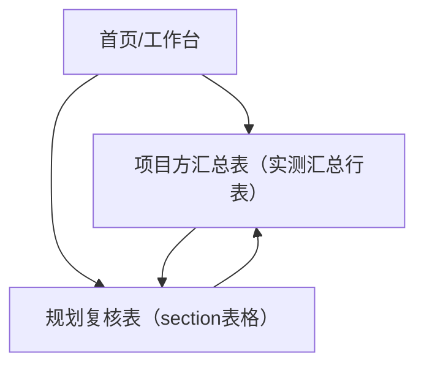

## 1. Product Overview
为“项目方汇总表-实测汇总行表”和“规划复核表-section表格”统一页面布局与底部导航条样式，提升跨页面使用的一致性与可预测性。
核心目标是：两类表格在滚动、固定区、操作入口与导航切换上遵循同一套规则，减少学习成本与误触。

## 2. Core Features

### 2.1 Feature Module
本次需求包含以下主要页面：
1. **首页/工作台**：入口导航（跳转到两张表）、最近访问（可选，仅展示入口）。
2. **项目方汇总表（实测汇总行表）**：表格展示、汇总行表现、统一底部导航。
3. **规划复核表（section表格）**：分区（section）表格展示、分区内滚动表现、统一底部导航。

### 2.2 Page Details
| Page Name | Module Name | Feature description |
|---|---|---|
| 首页/工作台 | 功能入口 | 提供两张表的入口按钮/卡片，点击跳转到对应页面。 |
| 首页/工作台 | 底部导航条 | 展示统一导航条；当前页高亮；支持在两张表间快速切换。 |
| 项目方汇总表（实测汇总行表） | 表格主体 | 展示明细行；支持横向滚动（列多时）与纵向滚动（行多时）。 |
| 项目方汇总表（实测汇总行表） | 固定区与汇总行 | 固定表头；“实测汇总行”固定在表格底部可见区域（不被底部导航遮挡）。 |
| 项目方汇总表（实测汇总行表） | 底部导航条 | 使用统一样式与高度；与表格内容区有安全间距，避免遮挡汇总行与最后一行。 |
| 规划复核表（section表格） | Section 分区 | 按 section 展示多个分区表格；分区标题可视（滚动时保持可感知）。 |
| 规划复核表（section表格） | 表格主体 | 分区内行列展示；遵循统一的滚动与固定表头规则（与汇总表一致）。 |
| 规划复核表（section表格） | 底部导航条 | 使用统一样式与高度；在任意 section 下滚动时保持常驻。 |

## 3. Core Process
### 3.1 主要用户流程（单一角色）
1. 你从“首页/工作台”进入应用。
2. 你点击入口进入“项目方汇总表”或“规划复核表”。
3. 你在表格内滚动查看数据；表头保持可见；在汇总表中可随时看到“实测汇总行”。
4. 你通过底部导航条在两张表之间切换；切换后落在对应页面的默认顶部位置（除非产品已有“记住滚动位置”，本次不新增）。

### 3.2 是否应补齐底部导航条（结论）
应补齐：两张表均属于“主工作流核心页面”，应共享同一套底部导航条（结构、尺寸、状态与交互一致）。
例外：若存在登录页、全屏编辑/弹窗、系统设置类深层页面，可不展示底部导航条（避免干扰与误导航）。

### 3.3 一致性规则与交互说明（作为验收标准）
- 规则 R1（覆盖范围）：所有“可从首页直达的核心页面”必须展示底部导航条；深层页默认不展示，除非它本身也是核心入口。
- 规则 R2（高度与安全区）：底部导航条高度固定；内容区底部必须预留等于“导航条高度 + 安全间距”的 padding，防遮挡最后一行/汇总行。
- 规则 R3（选中态）：当前页面对应的导航项必须高亮；高亮仅一种视觉方案（颜色/字重/底部指示其一，避免叠加过多）。
- 规则 R4（点击行为）：点击当前已选中导航项不触发刷新；点击其他项立即切换路由。
- 规则 R5（可用性）：若某页暂不可用，导航项显示禁用态且不可点击（不弹错误提示，除非已有统一策略）。
- 规则 R6（滚动关系）：导航条常驻（fixed/sticky）；表格滚动只影响内容区，不推动导航条。

