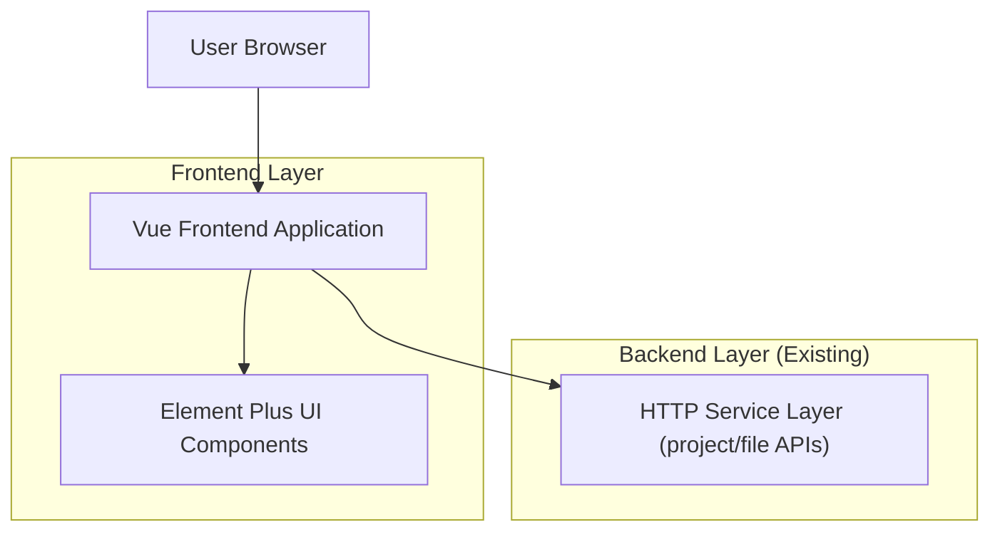

## 1.Architecture design

## 2.Technology Description
- Frontend: Vue@3 + Element Plus + vite
- Backend: 现有 HTTP API 服务（本次仅涉及前端展示与交互调整）

## 3.Route definitions
| Route | Purpose |
|-------|---------|
| /login | 登录页，建立登录态 |
| /dashboard | 首页/概览 |
| /projects | 项目信息页（包含归档目录 Tab 与目录树 + 文件列表） |
| /upload | 项目/文件上传 |
| /users | 用户权限管理 |
| /fields | 土地类型管理 |

## 4.API definitions (If it includes backend services)
本次改动为纯前端 UI/交互与文案调整，不新增/变更 API；沿用现有归档目录与文件列表相关接口。

## 6.Data model(if applicable)
本次改动不涉及数据模型与数据库变更。
