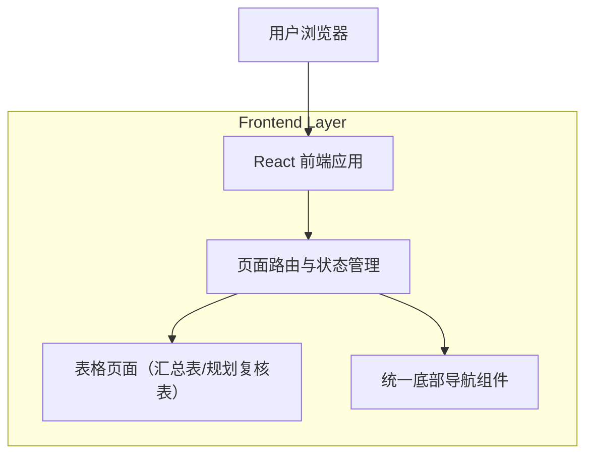

## 1.Architecture design

## 2.Technology Description
- Frontend: React@18 + TypeScript + vite
- Styling: tailwindcss（或现有 CSS 方案，复用现有设计变量）
- Backend: None（本需求为纯前端布局与组件一致性改造）

## 3.Route definitions
| Route | Purpose |
|---|---|
| / | 首页/工作台，提供两张表的入口与统一底部导航 |
| /project-summary | 项目方汇总表（实测汇总行表），统一表格布局与底部导航 |
| /planning-review | 规划复核表（section表格），统一表格布局与底部导航 |

## 6.Data model(if applicable)
本需求不涉及新增/变更数据模型。
